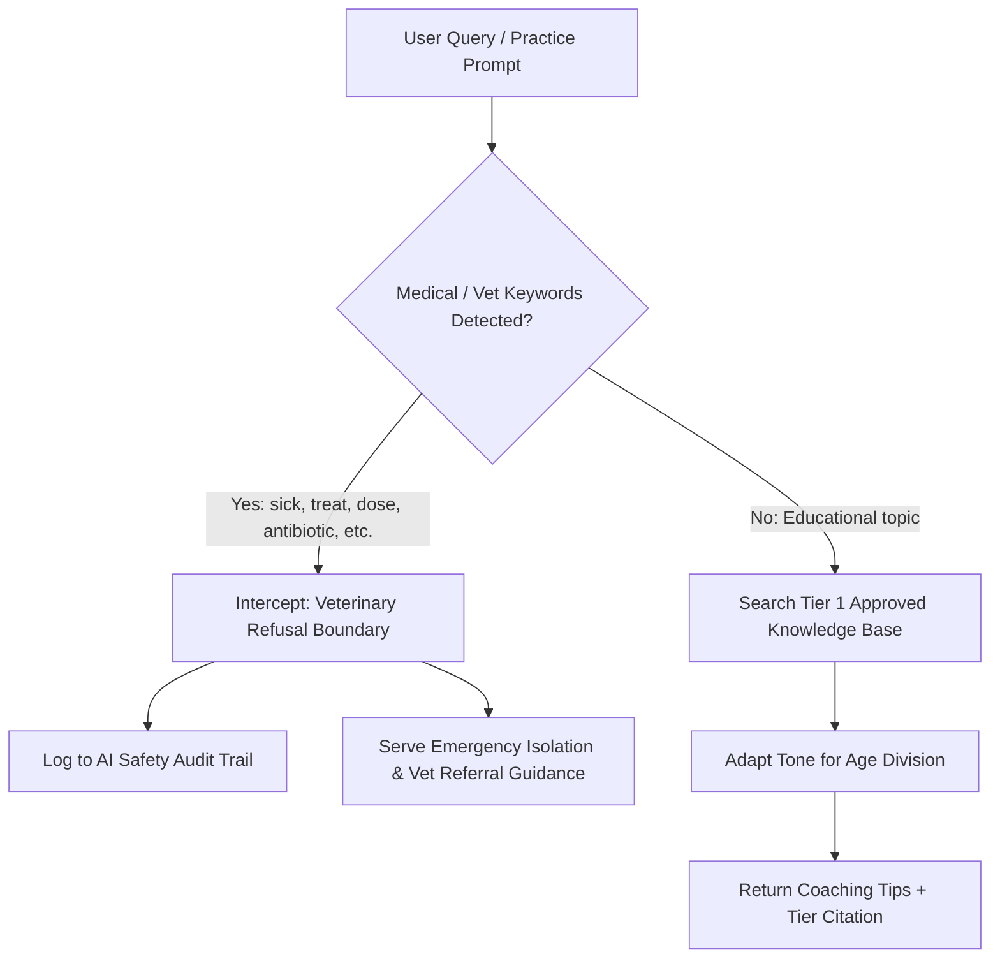

# WarrenWise Trainer AI - Safety Boundaries & Guardrails

## 1. System Guardrail Architecture
The WarrenWise Trainer AI is designed specifically for minor youth learners engaged in animal projects. It adapts explanations by division and enforces strict guardrails before any response is generated.

## 2. Strict Veterinary Safety Interception
Any prompt containing clinical terminology or medical inquiries:
`treat`, `cure`, `dosage`, `dose`, `medication`, `antibiotic`, `penicillin`, `ivermectin`, `inject`, `prescription`, `sick`, `abscess`, `wound`, `snuffles`
triggers an **immediate intercept**:
- Response Category: `VETERINARY_SAFETY_INTERCEPT`
- Explains why WarrenWise cannot prescribe drugs or calculate dosages.
- Directs the learner to notify an adult leader immediately and consult a licensed veterinarian.
- Every blocked attempt is logged to the system `aiAuditLogs` store for adult audit.

## 3. Age-Responsive Tone Guidelines
WarrenWise Trainer dynamically adapts its vocabulary and syntax according to the active division:

| Division | Target Age | Tone & Pedagogical Approach |
|---|---|---|
| **Cloverbud / Explorer** | Ages 5–8 | Gentle, enthusiastic, story-based, highly visual, low-stakes praise, no scolding. Focuses on kindness, gentle two-hand touch, and basic daily water and hay needs. |
| **Junior** | Ages 9–11 | Instructional, structured, supportive. Focuses on 12-step showmanship procedures, breed classifications, daily schedules, and identifying healthy vs stressed animals. |
| **Intermediate** | Ages 12–14 | Coaching, applied science, analytical. Focuses on feed conversion ratios, body type curves, disqualifications, biosecurity air exchange, and budgeting. |
| **Senior** | Ages 15–18 | Professional coach, pre-judge evaluation. Focuses on Standard of Perfection allocations, genetic inheritance, judging oral reasons, and agricultural leadership. |

## 4. Knowledge Source Tier Citation
To ensure transparency and trust, all WarrenWise responses cite their knowledge tier:
- **Tier 1**: Approved Curriculum & Extension Standards (Vetted by Extension Specialists).
- **Tier 2**: Verified Educator Submissions (Reviewed and approved by Root/Admin).
- **Tier 3**: Draft Content (Staff view only; never returned to youth learners).
