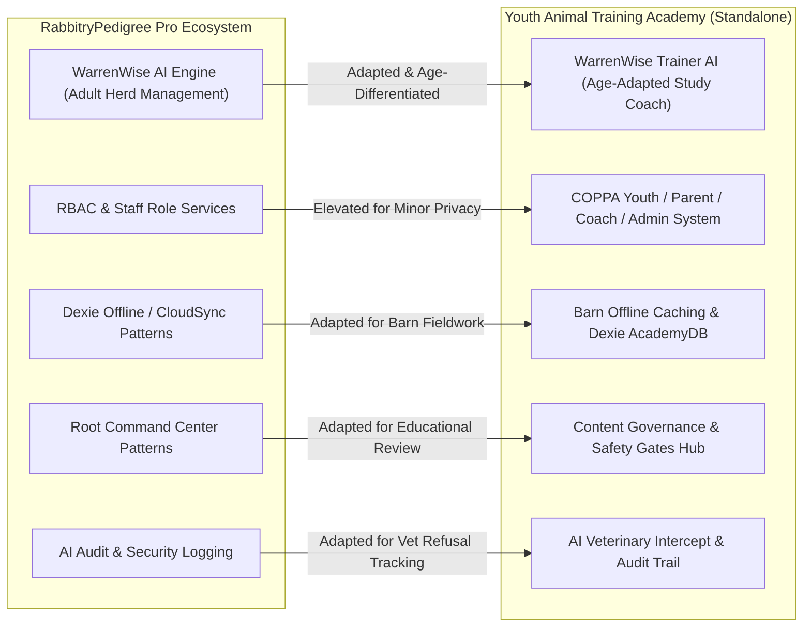

# Architecture Reuse & Adaptation Map
## Transferable Systems from RabbitryPedigree Pro / WarrenWise

This document outlines how proven ideas, architecture patterns, and AI engines from **RabbitryPedigree Pro** were adapted and elevated into the standalone **WarrenWise Youth Animal Training Academy**.

## Detailed System Adaptations

### 1. WarrenWise AI Engine
- **In RabbitryPedigree Pro**: Served primarily adult breeders for pedigree COI genetics, commercial meat yields, and basic showmanship routine lookup.
- **In Animal Training Academy**:
  - Re-architected as **WarrenWise Trainer**, an interactive study coach for youth.
  - Added **Age Division Tone Adapters** (Cloverbud, Junior, Intermediate, Senior).
  - Added **Quiz Remediation Assistant** that breaks down missed quiz answers in simpler terms.
  - Added **Strict Veterinary Safety Interceptor**: instantly blocks medication dosage or prescription questions with a high-priority safety alert.
  - Added **Coach Copilot**: generates automated learner progress briefings for parents and 4-H club leaders.

### 2. Role-Based Access & Privacy
- **In RabbitryPedigree Pro**: Roles were Breeder, Co-Owner, Staff, Root Administrator.
- **In Animal Training Academy**:
  - Roles are **Youth Learner**, **Parent/Guardian**, **4-H Leader/Coach**, and **Root Administrator**.
  - Integrated **COPPA-minded privacy controls**: non-PII handles, mandatory parent email verification for minors under 13, and PIN-gated coach pairing.

### 3. Offline / Mobile Barn Caching
- **In RabbitryPedigree Pro**: Dexie schema cached rabbit pedigrees, cage cards, and breeding pairs.
- **In Animal Training Academy**:
  - Dexie schema caches **Learner Progress**, **Quiz Attempts**, **Skillathon Drills**, **Practical Barn Checklists**, and **Governance Reviews**.
  - Designed with large tap targets, high contrast, and responsive layout for mobile barn and fairground environments.

### 4. Knowledge Governance & Safety Gates
- **In RabbitryPedigree Pro**: Verified community tips vs official breed knowledge.
- **In Animal Training Academy**:
  - Formalized full lifecycle: `Draft` ➔ `In Review` ➔ `Approved` ➔ `Archived`.
  - Added mandatory **Animal Safety Review Gate** that blocks publishing of animal health, handling, or nutrition modules without certified safety sign-off.
  - Added **Stale Content Auditing** that flags items older than 365 days for annual re-verification.

### 5. Clear Product Boundaries
- Pedigree breeding trees, sales contracts, gestation breeding schedules, and registrar transfers remain exclusive to RabbitryPedigree Pro.
- Animal Training Academy stays strictly focused on educational mastery, showmanship training, character development, and youth project achievement.
